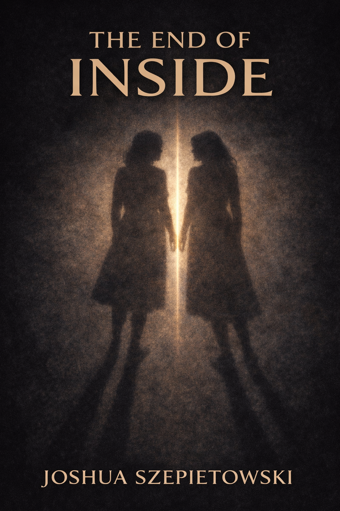

# The End of Inside

*A novel about connection, consent, identity, and the cost of being fully known.*

> How do we let another person in without erasing either of us?

**The End of Inside** is a sequel set in the universe of **[The House Without Walls](https://the-house-without-walls.joshszep.com)**. Fifteen years after the House became part of ordinary life, a generation has grown up treating shared empathy as normal. For Rei Nakamura, there has never been a meaningful barrier between herself and other people. Openness is not bravery. It is not even intimacy. It is home.

That is also the danger.

Around Rei, others open too quickly, merge too deeply, and do not always come back unchanged. When Suzu Sato, known as **Second Bell**, severs Rei from the shared field without her consent, Rei experiences isolation not as freedom, but as horror. What follows is not a rejection of connection. It is a struggle to discover whether intimacy can remain beautiful once it becomes ethical.

If **The House Without Walls** asked what happens when outer architecture dissolves, **The End of Inside** asks what happens when inner boundaries do.

## Premise

In a world shaped by ambient shared empathy, a young woman whose presence dissolves other people's boundaries is forcibly isolated by an extremist who believes she is saving lives. To survive, Rei must discover something she has never needed before: where she ends.

## Why This Story

- It treats connection as beautiful without pretending it is automatically good.
- It refuses the easy binary of total openness versus rigid individuality.
- It asks what consent means in a world where people can share internal states directly.
- It keeps the House mysterious, intimate, and lived-in rather than reducing it to explained machinery.
- It builds toward a form of forgiveness that is spoken, not imposed.

## The Core Triangle

### Rei

A young Japanese woman raised inside a world of openness so complete that separation feels like deprivation. She is kind, grounded, and dangerously unbounded.

### Suzu

A morally serious interventionist shaped by an older trauma. She does not hate Rei. She believes Rei is the kind of danger people only recognize after it is too late.

### Yui

The emotional center of the book. Drawn to Rei with full sincerity, she experiences both the beauty and the cost of connection that goes too far.

## What Kind of Novel This Is

**The End of Inside** is intimate, uncanny, and emotionally grounded. It is interested in people before systems, scenes before explanations, and consequence before philosophy. The world is speculative, but the pressure is human: love, consent, selfhood, grief, trust, and the difficult skill of letting another person in without disappearance.

## What It Moves Toward

- Connection without collapse
- Boundaries without prisons
- Responsibility without denial
- Forgiveness without coercion
- A final silence that says more than another page of explanation could
